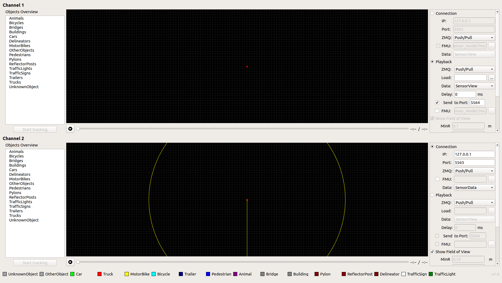
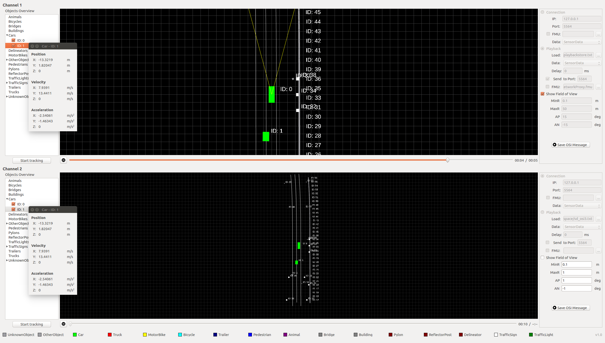
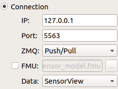
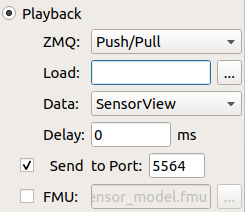
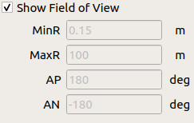
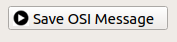

OSI Visualizer
==============

.. image:: https://travis-ci.org/OpenSimulationInterface/osi-visualizer.svg?branch=master
    :target: https://travis-ci.org/OpenSimulationInterface/osi-visualizer

OSI Visualizer serves as visualization tool for the current implementation of `OSI (Open
Simulation Interface)`_ messages. The osi-visualizer supports to visualize
the OSI GroundTruth and SensorData messages. It visualizes the ``GroundTruth``, ``SensorView`` and ``SensorData`` messages. It also supports two independent visual channels with two different input types (file and network stream).

Usage
-------

Use the configuration panel at the right (see Screenshot below) to load e.g. a playback file for channel 1 at Playback and choose a port to which it will be send (here 5564). Select the data type ``SensorView`` according to the content of the file. After that enter into the IP field the localhost and into the port field the receiving port (here 5563) for channel 2 in the panel below at Connection. Select the data type it is expected to visualize (here ``SensorData``). In this example an intermediary on ``localhost`` processes the data from the input file using a `OSMP <https://github.com/OpenSimulationInterface/osi-sensor-model-packaging>`_ sensor model, transforms it into ``SensorData`` and sends it to port 5563.

Now you can click on play for channel 1 and 2 and you can visualize the communication between these two channels. Channel 1 plays the selected OSI input file scenario and sends out the OSI message to port 5564 at the same time. Channel 2 visualizes the received OSI messages at ``localhost`` at port 5563 showing it on the canvas (see demo screenshot below).

Installation
-------------

**Environment and dependencies**

Currently we strongly recommend users to use the osi-visualizer under Ubuntu Linux 18.04 LTS. You can see a working development environment based on Ubuntu 18.04 LTS in the Dockerfile in the repository.

* `cmake <https://cmake.org/>`_ (>= 3.5) 
* `Qt <http://download.qt.io/official_releases/qt/>`_ (>= 5.5.0)
* `ZeroMQ <http://zeromq.org/intro:get-the-software>`_ (>= 4.2.1) OSI Visualizer needs to use ZeroMQ libraries to complete the socket communication between different sensor / traffic / scenario simulators. Note that the C++ Bindings are required as well.
* `protobuf <https://github.com/google/protobuf>`_ (>= 2.6.1)
* `FMILibrary <https://svn.jmodelica.org/FMILibrary/tags>`_ (>= 2.0.2)
* `OSI <https://github.com/OpenSimulationInterface/open-simulation-interface.git>`_ (>= 3.1.2) 

**Build and run**

.. code-block:: bash

    $ bash install.sh

or just manually if dependecies are already installed:

.. code-block:: bash

    $ git clone https://github.com/OpenSimulationInterface/osi-visualizer
    $ cd osi-visualizer
    $ git clone https://github.com/OpenSimulationInterface/open-simulation-interface
    $ mkdir build
    $ cd build
    $ cmake ..
    $ make
    $ ./osi-visualizer

Panels
--------

Connection:
~~~~~~~~~~~

The channel receives osi message from the network with specific IP
address and port number, and shows up different data types.

Playback:
~~~~~~~~~

The channel receives osi message from the loaded file. The tool will
check a header file of the same name with a extension: .txth. If it doesn't
exist, the tool will create one automatically for the first time. A
"Delta-Delay" variable can be set to slow down the playback speed in
case of very large message files. By default this value is "0" ms.

Example: Set it to 10 ms, each message will have 10 ms more delay for
playing.

Besides the tool provides sending out osi message to network with specific port number.

Show Field of View:
~~~~~~~~~~~~~~~~~~~

Shows the field of view for sensors, like lidar, on the grid. Users can set
minimum range, maximum range, azimuth positive angle and azimuth
negative angle.

Save OSI Message:
~~~~~~~~~~~~~~~~~

Log or cut out part of the osi message stream and save it to another
file. By default the threshold is 1000000 OSI messages. The User can change
this threshold in the `appconfig.cpp <https://github.com/OpenSimulationInterface/osi-visualizer/blob/7e8ae13ac01229753b11098c0f530163a59b9a07/src/appconfig.cpp#L53>`_.

Menu options
------------

File Menu:
~~~~~~~~~~

``Play``: Play/Pause Channel 1 by default.

``Python Compare``: A standalone compare tool to compare two osi
message file directly. By default, it takes the playback file from these
two channels. It supports flexible selecting random file as well. Just
put the python scripts into folder: ./Resources/Python/ before start
this tool. Then all the scripts will be shown up in the "Python Scripts"
select menu. The compare script should take the two osi files' full path
as arguments. The compare result can be exported to a text file by
clicking the "Export" button.

``Quit``: Quit the visualizer.

View Menu:
~~~~~~~~~~

``Combine Channels``: Config two channels' "Play/Pause"
simultaneously, or not. It can only be checked when the channels are at
the same status: both "Play" or "Pause". By default, it is unchecked.

``Show Grid``: Show up the grid in the canvas. By default, it is
checked.

``Show Object details``: Select object from the Objects Overview tree.
Show up the selected object's position, velocity and acceleration in
another independent dialog. By default, it is checked.

The others are self-explaining.

Notice
------

When playing large osi files, try to adapt the Delta Delay. Then the
tool renders smoothly.

.. _OSI (Open Simulation Interface): https://github.com/OpenSimulationInterface/open-simulation-interface
.. _`https://cmake.org/`: https://cmake.org/
.. _`http://download.qt.io/official_releases/qt/`: http://download.qt.io/official_releases/qt/
.. _`http://zeromq.org/intro:get-the-software`: http://zeromq.org/intro:get-the-software
.. _`https://github.com/google/protobuf`: https://github.com/google/protobuf
.. _`https://svn.jmodelica.org/FMILibrary/tags`: https://svn.jmodelica.org/FMILibrary/tags
.. _Open Simulation Interface: https://github.com/OpenSimulationInterface/open-simulation-interface.git