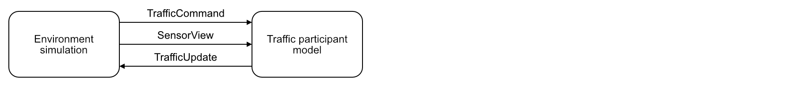
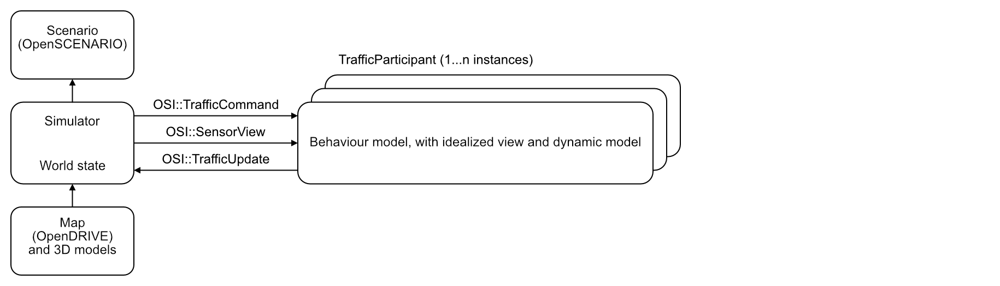
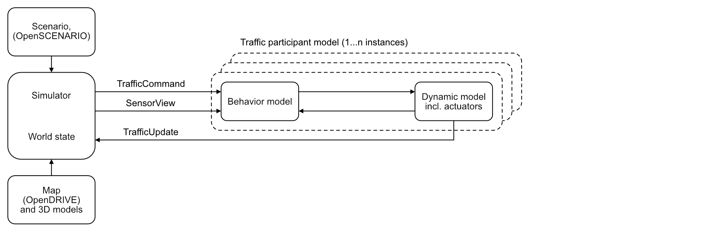
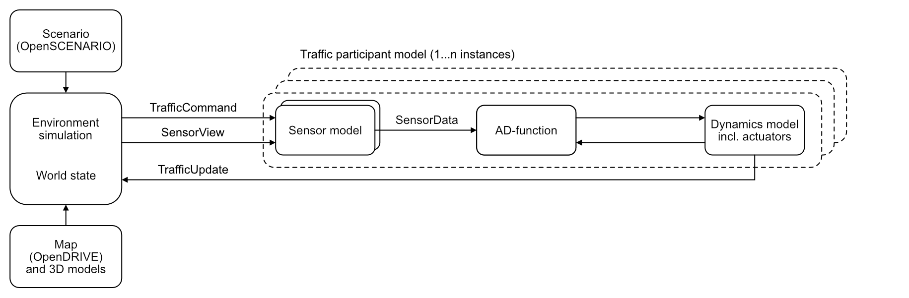
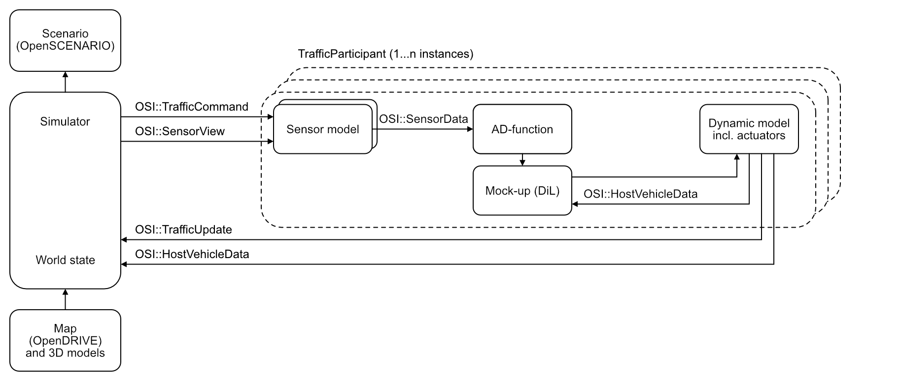
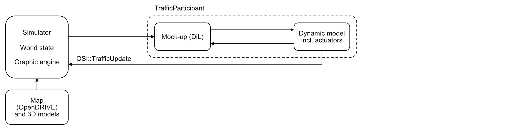

Modeling traffic participants
==============================

Traffic participants
--------------------

A traffic participant is an element of the simulated world, which can change its state during simulation time, for example, position and orientation.
A traffic participant represents one of the following:

- A living being.
- A means of transportation for living beings
- A means of transportation for goods
- Any other movable object that may travel the road network

Pedestrians and animals are examples of traffic participants that are living beings.
Vehicles are examples of traffic participants that are means of transportation.
Therefore, the ego vehicle is also a traffic participant.

The following figure shows the interface of a traffic participant.

With every simulation step, an OSI traffic participant model receives ground truth data from the environment around itself, the sensor view.
A traffic participant can output its own perceivable state, the traffic update.
Traffic commands influence the behavior of the traffic participant model.
They allow event-based communication towards the traffic participant, that is, at certain simulation steps.
Traffic commands do not necessarily need to come from the environment simulation.
They may come from a separate source, for example, a scenario engine.

Use cases for traffic participants
----------------------------------

Different models may be involved in modeling a traffic participant.
In all the use cases, a simulator loads and interprets a scenario and a map prior to execution.
The scenario is, for example, provided by OpenSCENARIO.
The map data is, for example, provided by OpenDRIVE.
During runtime the simulator interacts with the traffic participants via OSI messages.
There may be multiple instances of a traffic participant.
The traffic participants are co-simulated.

The following figure shows a very simple use case.

The traffic participant bases its behavior only on an idealized view of the area around it.
If they exist, the traffic participant’s dynamics are included in the model.

The following figure shows a traffic participant with separately modeled behavior and dynamics.

OSI currently provides only limited support for data structures describing measured internal states of the traffic participant.
Actuator intentions are currently not covered by OSI and must be handled with a different data description format.

The following figure shows a more complex traffic participant.

This use case will probably be relevant for modeling the ego vehicle, which includes the system-under-test.
The traffic participant includes an arbitrary number of sensor models
The sensor models consume sensor view and produce sensor data.
The AD function consumes sensor data and produces input for the dynamics model.
OSI currently does not support data flow to dynamics models.
The loop to the environment simulation is closed via traffic update.

The following figure shows a cooperative use case with both an AD function and a human driver.

It is possible to model a traffic participant with an AD function in the loop, but a human driver can still override the actuation command.
Such a cooperative use case is, for example, relevant to studies on human-machine interaction.
In this example, a virtual on-screen representation of the scenario, or mock-up, is added after the AD function.
The driver-in-the-loop interacts with the dynamics model via this mock-up.
OSI's limitations regarding dynamics-model input apply in this example as well.

The following figure shows a similar example with the difference that there is only a human driver in control.

